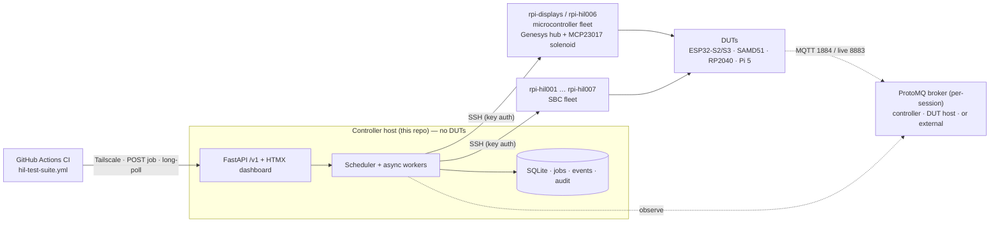
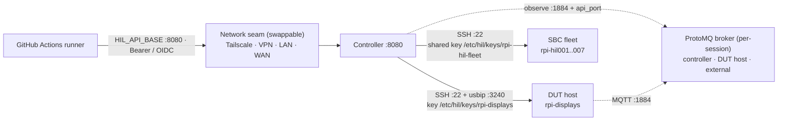
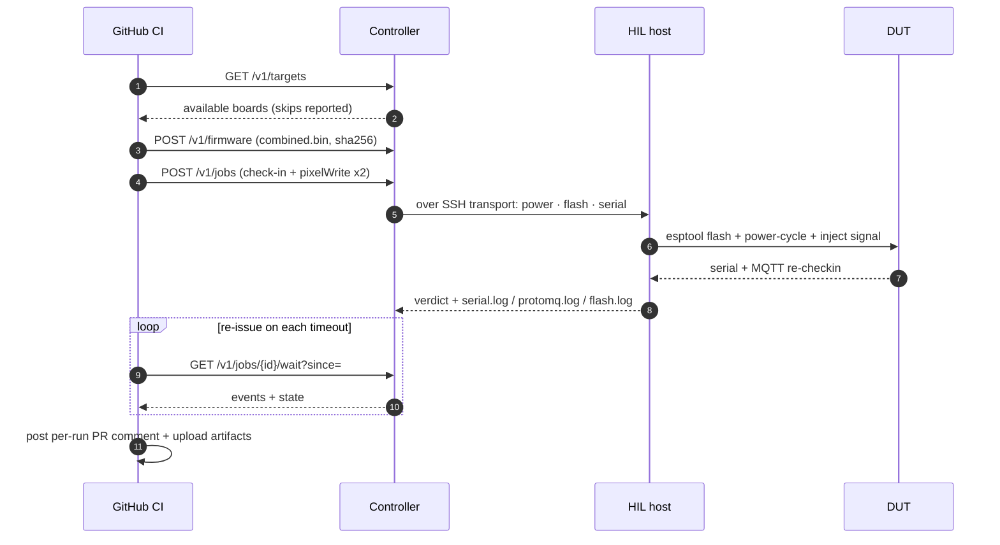
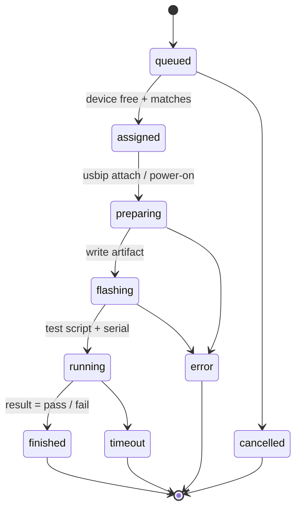

# HIL Platform Overview

Architecture, setup and process flow for the **USB-IP HIL Controller** — the hardware-in-the-loop test
platform behind the device check-in and pixelWrite regression runs in
[Wippersnapper Arduino PR #930](https://github.com/adafruit/Adafruit_Wippersnapper_Arduino/pull/930),
the on-board **display camera proofs** (flash → v2 check-in → display Add/Write → camera capture), and the
basis for extending the same machinery to **Wippersnapper Python** testing and manual bench work.

> A richer, illustrated version of this overview (hand-drawn SVG diagrams + tables) is in
> [`hil_platform_overview.html`](hil_platform_overview.html). This file is the GitHub-renderable summary.

## What it is

A small HTTP service that lets CI request a test against **real hardware** and get structured pass/fail
+ logs back — without the calling repo hosting a self-hosted GitHub runner. The controller is the seam
between four parties:

- **Caller** — a GitHub Actions job (or any client) submits a job and waits on a long-poll.
- **Controller host** — runs this repo: HTTP `/v1` API, HTMX dashboard, SQLite job store, scheduler. **No DUTs attached.**
- **HIL host fleet** — bench Raspberry Pis the controller fans work to over SSH; each owns a slice of the devices under test.
- **ProtoMQ broker** — what firmware talks to as an MQTT client during a test. **Per-session, not a fixed host:** launched on the controller (tachyon `192.168.1.169`), on a DUT host (e.g. `rpi-hil004`), or pointed at an external broker (staging `io.adafruit.us` / live `io.adafruit.com`). The controller observes it and writes the host:port into the DUT secrets.

The defining choice: **the work runs on the HIL host, not the controller.** Each worker holds an SSH session
to the host that owns its device and drives flashing, power, serial and camera capture *there*. One process,
one SQLite file, an asyncio worker pool — no Redis/Celery/external broker.

## Architecture

- **Concurrency** — per-device `asyncio.Lock`; per-host semaphore (SBC hosts = 1 job at a time);
  optional **exclusive-host** lock for unambiguous `dmesg`/`usbmon` capture.
- **Auth** — read-only dashboard pages are public on the LAN; every write needs a bearer token or
  verified GitHub Actions OIDC. Policy maps a repo/claim → device pools + secret profiles.
- **Topology** — hosts, devices, auxes, muxes, cameras and secret profiles are seeded from
  `/etc/hil/*.yaml` (hot-reloaded) and hydrated into the DB on startup. CI can dry-run a selector via
  `POST /v1/topology/resolve` before submitting.

## Services, ports, keys & endpoints

Where each service listens, what guards every hop, and why the network layer is interchangeable.

**The network seam is swappable.** The controller is just an HTTP service on `:8080`. CI reaches it however
the network allows — Tailscale MagicDNS today (`…ostrich-escalator.ts.net:8080`), but a plain LAN address
(`192.168.1.169:8080`), a WAN host (`wan.gdenu.fi:8080`), or any other VPN works identically. Only two CI
inputs change with the path: `HIL_API_BASE` (where) and the join step (`TAILSCALE_AUTHKEY`, or another VPN's).
The bearer token / GitHub OIDC is what *authorises* a job — independent of the transport that carried it.

### Service inventory (microservices per node)

| Node | Service / daemon | Port | Role |
|---|---|---|---|
| **Controller** | Caddy / nginx | `443` | TLS reverse proxy; dashboard on LAN |
| **Controller** | uvicorn · FastAPI | `8080` | `/v1` API, `/ui` HTMX, `/healthz`, `/readyz`, `/metrics` |
| **Controller** | SQLite (in-process) | — | jobs · events · audit (WAL) |
| **DUT host** (rpi-displays / hil006) | sshd | `22` | `pi` user, controller key authorised |
| **DUT host** | hil-usbipd | `3240` | USB/IP attach target — down ⇒ flash fails |
| **DUT host** | usbip-autobind (udev) | — | keeps DUT bound to `usbip-host` across resets |
| **DUT host** | solenoid control (`usb_hub.py`) | I²C `0x20` | MCP23017 on bus 1 + HID solenoid hub — USB power plane |
| **DUT host** (e.g. rpi-hil006) | pi-camera-server (picamera2) | `8080` | CSI imx708 still/MJPEG over HTTP — autofocus + **manual exposure/gain** (`GET /?full=1&exposure=&gain=`), `POST /lens` focus, `/illuminator`; lets a bright self-lit TFT be photographed without auto-exposure crushing it to black |
| **DUT host** | flash + serial tools | — | `esptool`/`picotool`/`uf2-msc` over SSH, `/dev/serial/by-id/…` (legacy benches also read a CSI cam as `v4l2:0` over SSH) |
| **SBC fleet** (rpi-hil001–007) | sshd | `22` | shared fleet key; per-port power planned |
| **ProtoMQ broker** *(per-session)* | MQTT | `1884` / `8883` | DUT connects as client; bench `1884`, live IO `8883` |
| **ProtoMQ broker** | HTTP control API | `api_port` | `/api/echo`, `/api/autoresponse` (signal injection) |
| **ProtoMQ broker** | web UI | `5173` | broker inspection |
| **IP webcam** (Android) | HTTP MJPEG | `8080` | `/video`, `/shot.jpg` — pulled directly by controller |

### Keys, tokens & secrets

| Credential | Where it lives | Guards |
|---|---|---|
| Per-host SSH private keys | controller `/etc/hil/keys/*` (0400, user `hil`) | SSH hop to each HIL host |
| rpi-displays key | `/etc/hil/keys/rpi-displays` | the microcontroller host |
| **Shared SBC fleet key** | `/etc/hil/keys/rpi-hil-fleet` | all of rpi-hil001–007 (per-host `known_hosts` pinning) |
| Bearer tokens | argon2id in SQLite; `mint-token.py`, shown once as `hil_<id>_<secret>` | every `/v1` write |
| GitHub OIDC | JWKS at `token.actions.githubusercontent.com`, `aud=hil-controller` | CI writes, no long-lived secret |
| `/etc/hil/secrets.env` | systemd `EnvironmentFile` (0400) | AIO + Wi-Fi creds referenced as `${env:…}` |
| CI repo secrets | on the calling repo | `TAILSCALE_AUTHKEY_*`, `HIL_API_KEY_*`, `HIL_IO_*`, `HIL_WIFI_*` |

**USB power plane (the solenoid).** "Toggle USB" is a physical solenoid pulse, not a software port-disable.
The Genesys hub's per-port power is driven by an **MCP23017 GPIO expander at I²C `0x20`** (bus 1); `usb_hub.py` /
`solenoid_hub_control.py` pulse the channel mapped to each device, and a per-board *timing profile*
(`standard`, `samd51_uf2`, …) shapes the power/reset pulse so the board enters the right bootloader. After the
power-cycle, `usbipd` (`:3240`) re-attaches the DUT. Manual equivalents: `turn_on.sh` / `turn_off.sh` / `solenoid_hub_cli.py`.

## End-to-end regression flow

`low_ref` = a published release, `high_ref` = this PR's build. The same engine runs any A/B comparison.

The CI submits a **test array** (each test = its own driver, reported individually, `if: always()`):

| Test | Driver | Verdict |
|---|---|---|
| Device check-in *(default gate)* | `hil-checkin-run.sh` — flash → secrets → power-cycle → verify_checkin | `CHECKIN_VERDICT ok=true` |
| pixelWrite regression *(#926, fixed by #927)* | `hil-pixelwrite-run.sh` — A/B low vs high | LOW `rebooted=true` · HIGH `rebooted=false` |
| Display proof *(spec-driven)* | `hil_display_test.py` + `specs/*.json` — flash → checkin → display Add/Write → `capture_display` | `DISPLAY_CAPTURE_VERDICT` + a camera image embedded in the PR comment |

Inside **firmware-bench** (pluggable `STAGE_HANDLERS`, so a new regression is just a new stage list + assertion):

`enter_bootloader → erase → flash → verify → launch_protomq → write_secrets_msc → power_cycle → inject_pixelwrite → verdict`

Signal injection (`ws_signal_inject`) encodes the exact 11-byte nanopb `PixelsWriteRequest`, fires it via the
broker's `POST /api/echo`, then watches MQTT: a reboot in-window = crash; silence = survived. The broker
host:port is **not** a CI input — the `write_secrets_msc` stage fills `io_url`/`io_port` from the per-session broker.

**Generic injection + visual proof.** `inject_protobuf` is the general stage: it publishes ANY
`ws.signal.BrokerToDevice` to the broker — a builder `kind` the controller encodes from params
(e.g. `display_add_i8080`), or a raw `payload_hex` — so display Adds/Writes and component/I²C adds all
reuse the same `/api/echo` path. `verify_checkin` is **v2-aware**: it watches both the v1
(`…/wprsnpr/#`) and v2 (`…/ws-d2b/#`) check-in topics concurrently. For displays, **`capture_display`**
then photographs the lit panel — it locks the autofocus-converged dioptre (continuous AF drifts mid-grab and
blurs text), grabs a manual-exposure still bright enough for a self-lit TFT, crops the device ROI (scaled
frame-relative from the warm frame to the native `?full=1` frame), and white-patch white-balances off the lit
text — emitting `DISPLAY_CAPTURE_VERDICT` + a JPEG asset. A display-proof job is just a different stage list:
`… → verify_checkin → inject_protobuf (display Add) → inject_protobuf (display Write) → capture_display`.

## Job lifecycle

`finished` + `pass`/`fail` (the test gave a verdict) is deliberately distinct from `error` (infrastructure:
flash failed, USB-IP gone) and `timeout` (phase budget exceeded). Every transition writes an append-only
event powering the long-poll wakeup, the live HTMX log view, and the audit trail.

## Setup & deployment (three tiers)

1. **Controller host** — any Linux box with reach to the bench. `uvicorn hil_controller.main:app` behind
   Caddy/nginx; SQLite (WAL) + artifacts in `/var/lib/hil/`; YAML config + per-host SSH keys in `/etc/hil/`.
2. **HIL host fleet** — `scripts/setup-hil-host.sh` authorises the controller key, installs `usbip-autobind`,
   masks ModemManager, opts into `dwc2` on Pi Zero, and (on `rpi-displays`) installs solenoid-hub control + udev rules.
3. **ProtoMQ broker** — *per-session, not a dedicated host.* Launched on the controller (tachyon), on a DUT host (e.g. `rpi-hil004`), or pointed at an external broker (staging `io.adafruit.us` / live `io.adafruit.com`, MQTT `8883`). Bench ProtoMQ = MQTT `1884` + web UI `5173`; host:port written into `secrets.json` at flash time.

CI secrets on the calling repo: `TAILSCALE_AUTHKEY_*`, `HIL_API_KEY_*`, `HIL_IO_USERNAME`/`HIL_IO_KEY`,
`HIL_WIFI_SSID`/`HIL_WIFI_PASSWORD`; vars `HIL_API_BASE`, `HIL_LOW_REF`, `HIL_TARGETS`.

## Manual operation

Everything an automated job does is also a hands-on control — for bring-up, debugging a wedged board, or
eyeballing a display. From the dashboard (or `solenoid_hub_cli.py` / `turn_on.sh` / `turn_off.sh`) an operator can:

- **Log in to a device** — SSH to its owning host, open a serial console, browse the device detail page.
- **Toggle USB power / reset** — per MCP23017 solenoid channel, with per-board timing profiles; learn USB IDs.
- **Flash / deploy on demand** — `esptool` · `picotool` · `uf2-msc` · `git-source`, the same adapters jobs use.
- **Camera control** — snapshot, set ROI, QR-assisted calibration, autofocus + **manual exposure/gain** and focus-lock for bright self-lit panels (CSI pi-camera-server + IP-webcam); `capture_display` yields the cropped, white-balanced proof.
- **Submit ad-hoc jobs** — `raw-firmware-smoke` / `git-clone-and-run` behind the `trusted-firmware` gate.

Feedback streams back live: serial tail (HTMX SSE), camera frames/ROI, flash + protomq logs, and
`dmesg`/`usbmon` when a job holds the host exclusively.

## Extending to Wippersnapper Python

Same job-submission shape, same controller spine — only the **payload kind** and the **deploy/runner adapter** change.

| | Arduino (today) | Python (planned) |
|---|---|---|
| Payload | `firmware-binary` | `git-source` |
| Deploy | flash (esptool / picotool / uf2-msc) | `GitDeploy`: clone ref + submodules → render `.env`/secrets → `pip install -e .` |
| Target | MCU on `rpi-displays` solenoid hub | Pi 5 on `rpi-hil00N`, **or** `LocalTransport` (no hardware) |
| Script | `firmware-bench` / `raw-firmware-smoke` | `git-clone-and-run` → `pytest -m <marker>` via `tests/runner.py`; exit code → pass/fail |
| Broker | ProtoMQ (per-session: controller / DUT host / external) | same |

Reused unchanged: **auth & policy, scheduler & transport, availability / `/v1/targets`, secret-profile
materialisation, log/camera capture, long-poll, per-run PR comment.** The existing `hil-detection` pytest
conftest (SSH into a HIL host, toggle the USB hub, flash, mount CIRCUITPY) is the working prototype this
architecture formalises.

**Net:** adding Python WS testing is a new payload kind + a deploy/runner adapter on top of a platform that
already handles auth, scheduling, secrets, capture and reporting — and the same platform doubles as a manual bench.

---

*Sources: `docs/ARCHITECTURE.md`, `docs/hil-regression-pipeline.md`, `docs/CAMERA_INTEGRATION.md`, and the live `/v1` API surface in `src/hil_controller/`.*
